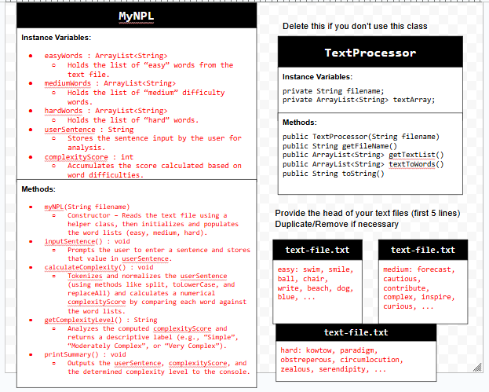
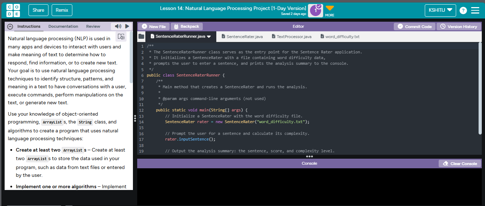

# Unit 6 - Natural Language Processing Project

## Introduction

Natural language processing (NLP) is used in many apps and devices to interact with users and derive meaning from text for tasks such as responding to commands, searching for information, or even generating new content. In this project, I applied NLP techniques to analyze and rate the complexity of user-entered sentences based on pre-defined word difficulty levels. The project demonstrates the use of object-oriented programming, ArrayLists, string manipulation, and algorithms.

## Requirements

The project meets the following requirements:
- **Create at least two ArrayLists:**  
  The project utilizes multiple ArrayLists (e.g., `easyWords`, `mediumWords`, and `hardWords`) to store data from a text file.
- **Implement one or more algorithms:**  
  Custom algorithms process text by tokenizing input and calculating a complexity score using loops and conditionals.
- **Use methods in the String class:**  
  Methods such as `split()`, `substring()`, `toLowerCase()`, and `replaceAll()` are used to manipulate and analyze text.
- **Use at least one natural language processing technique:**  
  A simple NLP technique is implemented where the program analyzes a sentence to rate its complexity based on word difficulty.
- **Document your code:**  
  All key classes and methods are fully documented using Javadoc comments, and inline comments are provided for clarity.

## UML Diagram

Below is a UML diagram for the project that describes the structure and relationships between the key classes.  
Make sure the image file is added to your repository (the file name must be a single word without spaces).

## Video

Below is a link to a short video demonstration of the project in action. The video shows how the program accepts user input, processes it, and outputs the analysis result.

[(VideoThumbnail.png)](https://youtu.be/EjIsXojiDyQ)

## Project Description

This project is designed to assess the complexity of a sentence entered by a user by comparing each word in the sentence against lists of easy, medium, and hard words stored in a text file. The `TextProcessor` class reads and converts the data from the file into ArrayLists, and the `SentenceRater` class processes a sentence entered by the user. Based on the difficulty of each word, a numerical complexity score is computed, and a descriptive level (Simple, Moderately Complex, or Very Complex) is provided. This application basically demonstrates the integration of file I/O, data processing, and natural language processing fundamentals.

## NLP Techniques

The natural language processing technique implemented in this project involves both **tokenization** and **normalization**:

- **Tokenization:**  
  The user’s sentence is split into individual words (tokens) using the `split(" ")` method. This process converts the sentence into an array of words that can be individually analyzed.

- **Normalization:**  
  Each token is normalized by converting it to lowercase and removing any non-alphabetic characters using the methods `toLowerCase()` and `replaceAll("[^a-z]", "")`. This standardizes the text, ensuring that words are compared fairly against our difficulty lists regardless of their original format.

- **Complexity Scoring:**  
  The normalized tokens are then compared against three ArrayLists containing "easy," "medium," and "hard" words. Depending on which list a token is found in, it contributes 1, 2, or 3 points toward a cumulative complexity score. This score is then used to classify the sentence as "Simple," "Moderately Complex," or "Very Complex."

The key methods associated with these techniques include:
- `SentenceRater.inputSentence()`: Captures user input.
- `SentenceRater.calculateComplexity()`: Performs tokenization, normalization, and scoring of the sentence.
- `SentenceRater.getComplexityLevel()`: Determines the qualitative complexity level based on the score.
